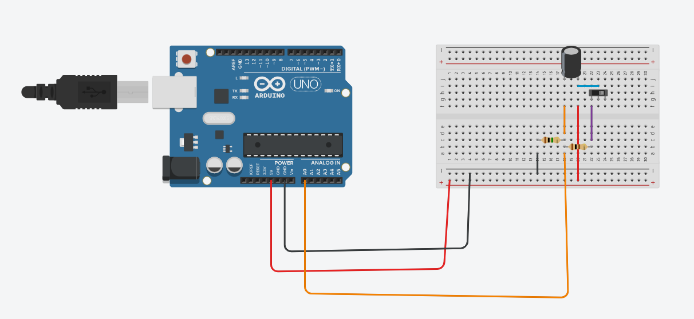
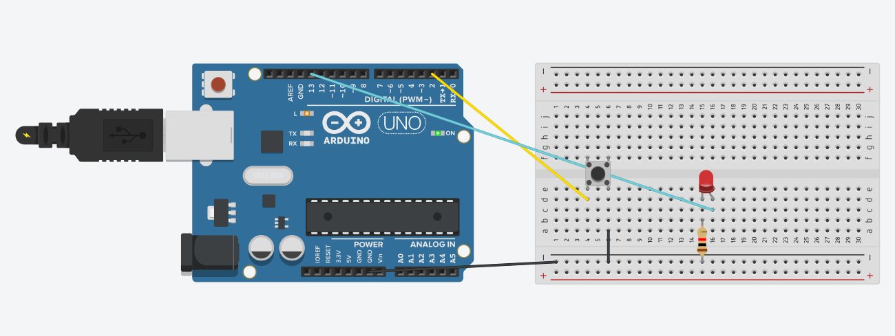
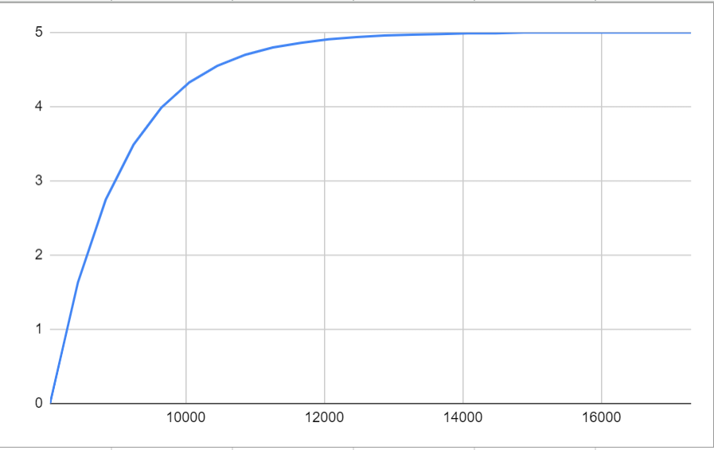
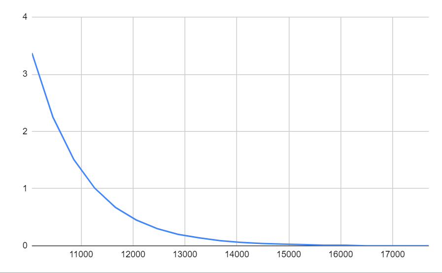

# Relatório da atividade desenvolvida em sala
As seguintes atividades foram desenvolvidas: um circuito RC simulado (Resistor-Capacitor) e um circuito pull up com led.

Links dos projetos simulados no tinkercad: 
[Circuito Pull Up - simulado](https://www.tinkercad.com/things/3gPkmqnclNT-shiny-luulia/editel) 
[Circuito RC - simulado](https://www.tinkercad.com/things/0tH57cuKe1k-neat-blorr/editel)

## Matériais utilizados
| Circuito RC |
|--------- |
| Arduino UNO  |
| Protoboard  | 
|  3 fios de conexão com a protoboard | 
| 5 fios de conexão dos componentes  | 
| Capacitor ($10\mu$ F / $25V$) | 
| 1 resistor ($1m\Omega$)  | 
| 1 resistor ($100\Omega$) |
| Interruptor deslizante |

---

| Circuito Pull Up |
|--------- |
| Arduino UNO  |
| Protoboard  | 
|  3 fios de conexão com a protoboard | 
| 1 fio de conexão dos componentes  | 
| 1 push botton | 
| 1 led  | 
| 1 resistor ($1k\Omega$) |

# Circuito RC (Resistor - Capacitor)

# Circuito Pull Up com led

# Montagem dos circuitos
## Circuito Pull Up com led
&emsp;Bom, inicialmente vamos recordar o objetivo da montagem: conhecer sensores e autadores básicos utilizados em projetos de soluções para internet das coisas (IoT).  
&emsp;Para esse projeto utilizaremos as seguintes conexões para ligar o circuito: a porta GND (terra) deve estar em ligação com o push botton, a porta 2 faz ligação com o push botton, utilizamos a porta 13 para conectar o led ao circuito. Lembre-se de usar o resistor para diminuir a corrente elétrica (caso contrário o led vai queimar). O resistor deve estar conectado com o caminho para a porta GND do arduino UNO. 
&emsp; Dessa forma, com os componentes devidamente conectados podemos controlar o nosso Led, ligando e desligando com o push button.

## Circuito RC
&emsp;Esse projeto tem como objetivo demonstrar de maneira prática o funcionamento dos capacitores.  
&emsp;Dessa forma, vamos para a montagem do circuito, as seguintes portas serão utilizadas: 5V, GND, A0. As seguintes conexões são realizadas: a porta 5V se conecta ao capacitor e também ao display, a porta 5V se conecta ao capacitor tendo como intermediário um resistor (para controlar a corrente elétrica), o diplay tem conexão com o capacitor que retorna a porta A0.

### Funcionamento da Carga e Descarga de um capacitor no circuito
#### Gráfico de carga do capacitor em relação ao tempo, tensão do resistor e tensão do capacitor

| Tempo (ms)   | Tensão do resistor | Tensão do capacitor |
|---------  |--------- |--------- |
| 61       | 0.29    | 4.71    |
| 28963    | 0.28    | 4.72    |
| 29366    | 0.26    | 4.74    |
| 29768    | 0.25    | 4.75    |
| 30171    | 0.24    | 4.76    |
| 30573    | 0.23    | 4.77    |
| 30976    | 0.22    | 4.78    |
| 31378    | 0.22    | 4.78    |
| 31780    | 0.21    | 4.79    |
| 32182    | 0.20    | 4.80    |
| 32584    | 0.19    | 4.81    |
| 32987    | 0.19    | 4.81    |
| 33389    | 0.18    | 4.82    |
| 33792    | 0.17    | 4.83    |
| 34194    | 0.17    | 4.83    |
| 34596    | 0.16    | 4.84    |
| 34999    | 0.15    | 4.85    |
| 35401    | 0.15    | 4.85    |
| 35804    | 0.14    | 4.86    |
| 36206    | 0.13    | 4.87    |
| 36608    | 0.13    | 4.87    |
| 37010    | 0.12    | 4.88    |
| 37412    | 0.12    | 4.88    |
| 37815    | 0.11    | 4.89    |
| 38217    | 0.11    | 4.89    |
| 38620    | 0.11    | 4.89    |
| 39022    | 0.10    | 4.90    |
| 39425    | 0.10    | 4.90    |
| 39827    | 0.09    | 4.91    |
| 40229    | 0.09    | 4.91    |
| 40632    | 0.09    | 4.91    |
| 41033    | 0.08    | 4.92    |
| 41436    | 0.08    | 4.92    |
| 41838    | 0.08    | 4.92    |
| 42241    | 0.07    | 4.93    |
| 42643    | 0.07    | 4.93    |

O cálculo da capacitância nesse circuito, quando o capacitor esta sendo carregado se dá pela seguinte fórmula: 

> $v(t)=E(1-e^{-t/RC} )$

---

#### Gráfico de descarga do capacitor em relação ao tempo, tensão do resistor e tensão do capacitor

| Tempo (ms) | Tensão do resistor | Tensão do capacitor |
| ------ | -------- | -------- |
| 10456  | 4.85     | 0.15     |
| 10858  | 4.66     | 0.34     |
| 11260  | 4.48     | 0.52     |
| 11662  | 4.30     | 0.70     |
| 12064  | 4.13     | 0.87     |
| 12467  | 3.97     | 1.03     |
| 12869  | 3.81     | 1.19     |
| 13272  | 3.66     | 1.34     |
| 13674  | 3.51     | 1.49     |
| 14076  | 3.38     | 1.62     |
| 14479  | 3.25     | 1.75     |
| 14881  | 3.12     | 1.88     |
| 15284  | 2.99     | 2.01     |
| 15686  | 2.87     | 2.13     |
| 16088  | 2.76     | 2.24     |
| 16490  | 2.65     | 2.35     |
| 16892  | 2.55     | 2.45     |
| 17295  | 2.45     | 2.55     |
| 17697  | 2.35     | 2.65     |
| 18100  | 2.26     | 2.74     |
| 18502  | 2.17     | 2.83     |
| 18905  | 2.08     | 2.92     |
| 19307  | 2.00     | 3.00     |
| 19709  | 1.92     | 3.08     |
| 20112  | 1.85     | 3.15     |
| 20513  | 1.77     | 3.23     |
| 20916  | 1.71     | 3.29     |
| 21318  | 1.64     | 3.36     |
| 21721  | 1.57     | 3.43     |
| 22123  | 1.51     | 3.49     |
| 22525  | 1.45     | 3.55     |
| 22928  | 1.39     | 3.61     |
| 23330  | 1.34     | 3.66     |
| 23733  | 1.29     | 3.71     |
| 24135  | 1.24     | 3.76     |
| 24538  | 1.19     | 3.81     |
| 24939  | 1.14     | 3.86     |
| 25341  | 1.09     | 3.91     |
| 25744  | 1.05     | 3.95     |
| 26146  | 1.01     | 3.99     |
| 26549  | 0.97     | 4.03     |
| 26951  | 0.93     | 4.07     |
| 27354  | 0.89     | 4.11     |
| 27756  | 0.86     | 4.14     |
| 28158  | 0.83     | 4.17     |
| 28561  | 0.79     | 4.21     |
| 28963  | 0.76     | 4.24     |
| 29365  | 0.73     | 4.27     |
| 29767  | 0.70     | 4.30     |
| 30170  | 0.67     | 4.33     |

O cálculo da capacitância nesse circuito, quando o capacitor esta sendo descarregado se dá pela seguinte fórmula: 

> $v(t) = E.e^{-\frac{t}{RC}}$

## Conclusão
&emsp; Com os testes dos projetos propostos foi possível entender o funcionamento de componentes importantes para o desenvolvimento de projetos para Internet das Coisas: o capacitor e o push button.
